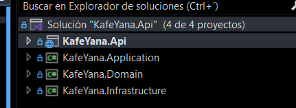

# ☕ KafeYana API

Backend API REST + GraphQL para la gestión integral de cafeterías y restaurantes. Incluye punto de venta, inventario, caja, promociones, programa de fidelización y facturación electrónica integrada con el **SIAT** (Bolivia).

## 📋 Descripción

KafeYana es un sistema POS (Point of Sale) orientado a negocios de comida y bebida. Permite administrar mesas, pedidos, ventas, stock, reportes y facturación fiscal desde una API moderna en .NET 9.

El frontend se consume de forma independiente (por ejemplo, una SPA en Vercel).

## ✨ Características principales

### Operaciones del negocio
- **Mesas y pedidos** — Gestión de salón, rondas de pedido y cobro
- **Ventas y caja** — Apertura/cierre de caja, movimientos y reportes
- **Inventario** — Productos, elaborados, insumos, recetas, combos y variaciones
- **Proveedores y órdenes de compra**
- **Ajustes de stock** y movimientos de inventario

### Marketing y fidelización
- **Promociones permanentes** (descuentos, productos gratis)
- **Promociones de temporada**
- **Hitos de compra** y sistema de **puntos**
- **Programa de referidos**
- **Productos canjeables**

### Facturación (Bolivia — SIAT)
- Emisión de facturas electrónicas
- Gestión de CUIS/CUFD
- Contingencia y eventos significativos
- Verificación de NIT
- Impresión térmica de facturas

### Tecnología y comunicación
- **REST API** con documentación OpenAPI (Scalar)
- **GraphQL** con HotChocolate (consultas, filtros, ordenamiento)
- **SignalR** para notificaciones en tiempo real (salón, caja)
- **JWT + Refresh Token** con cookies HttpOnly
- **Almacenamiento de imágenes** en Cloudflare R2
- **Reportes PDF** con QuestPDF
- Integración con **Yana Bot** (webhook)

## 🏗️ Arquitectura

El proyecto sigue **Clean Architecture** en 4 capas: 

📄 Licencia
Este proyecto es privado. Todos los derechos reservados.

